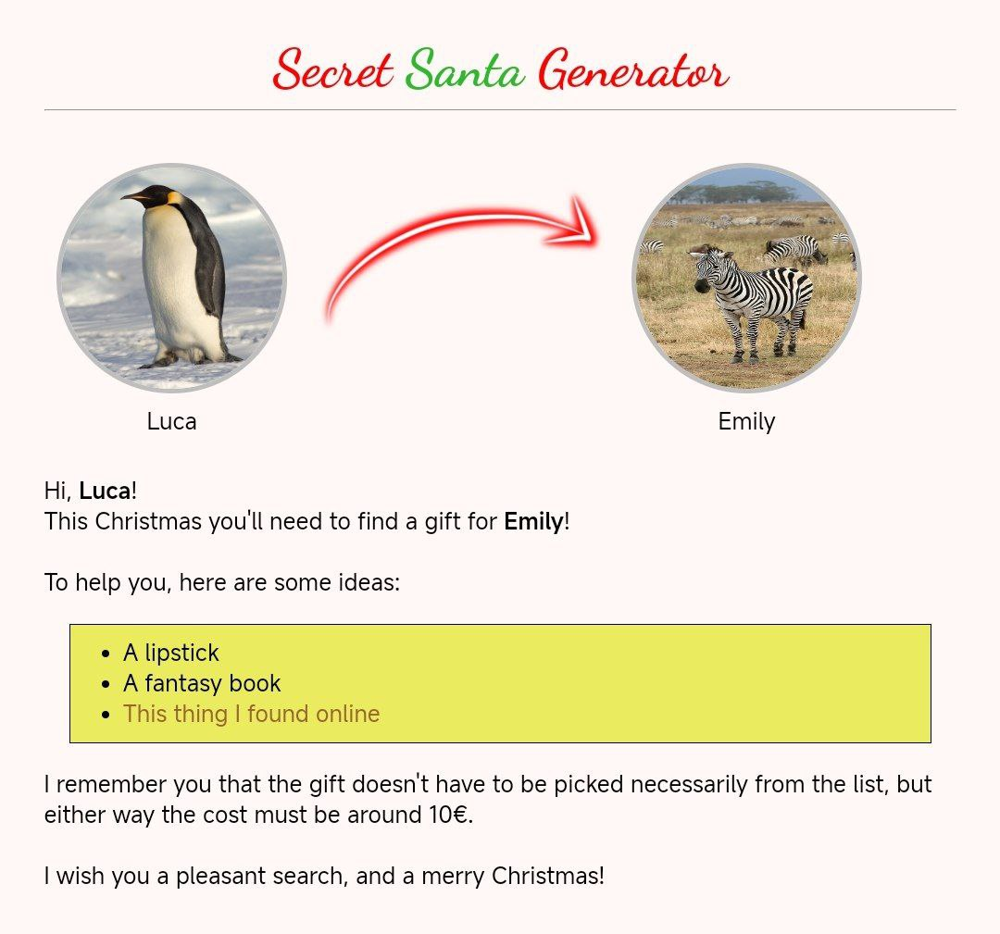

# Secret Santa Generator

Secret Santa Generator is a simple CLI script that generates the Secret Santa's couples for you.
Once you've added all the participants, their email, and optionally a propic and some ideas, it will
send and email to each one of them, with the extracted gift-receiver.

To run it, simply create a copy of (or edit) `config_sample.json` and `players_sample.json`, then use
`go run . <config_file> <players_file>`. 

The code is released with the [Unlicense](LICENSE). Feel free to contribute.
