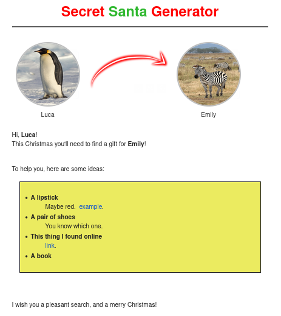

# Secret Santa Generator

Secret Santa Generator is a simple CLI script that generates the Secret Santa's couples for you.
Once you've added all the participants, their email, and optionally a propic and some ideas, it will
send and email to each one of them, with the extracted gift-receiver.



You can run it with:

```
go build -o ssg .
./ssg --config <config_file> --email <email_file> [--dont-send] [--sleep <duration>] [--test]
```

where

- `config_file` is the path to your config file
- `email_file` is the path to your email file
- `--dont-send`, if set, will skip the email sending stage
- `--sleep` can set a custom sleep time; `--sleep 0` will be blazingly-fast!
- `--test`, if set, will pair everyone with themself.

An `email_file` has the following structure (all the fields are required):

```jsonc
{
    "address": "", // the sender's email
    "host": "",    // the mail server's host
    "port": 0,     // the mail server's port
    "login": "",   // used when logging into the mail server
    "password": "" // used when logging into the mail server
}
```

A `config_file` has the following structure:
```jsonc
{
    "subject": "", // the emails subject; optional

    "notes": "", // added on the bottom on the email; optional

    "lang": "", // one of the ones available; optional

    "players": [ // the list of players; required
        {
            "name": "",     // the player's name; required
            "email": "",    // the player's email; required
            "pic_path": "", // the path of the player's picture; optional
            "ideas": [      // the list of options; optional
                {
                    "name": "", // required
                    "description": "", // optional
                    "links": { // optional
                        "link_name": "link_url"
                        // ...
                    },
                }
                // ...
            ]
        }
        // ...
    ]
}
```

Note that `templates/*`, `pics/_missing.png` and `pics/_arrow.png` are embedded
into the executable, so you'll have to rebuild it in order to use the new files.

The code is released with the [Unlicense](LICENSE). Feel free to contribute.
